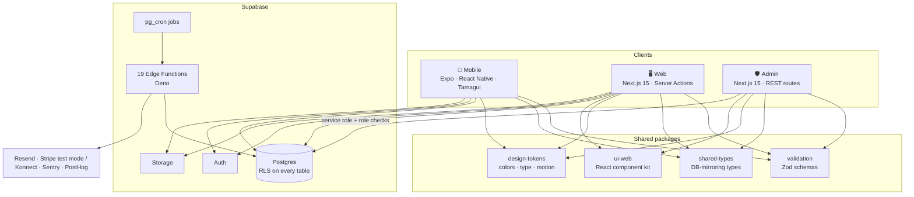

<div align="center">

# Dala

### _La base de tout chantier._

**A multi-tenant construction-site management platform built for Tunisia's BTP sector.**
One backend, three apps: a mobile app for the field, a web app for the office, and a locked-down admin console for the platform operator.

<br />


<br />

[The problem](#-the-problem) · [Three surfaces](#-three-apps-one-backend) · [Features](#-features) · [Architecture](#-architecture) · [Security](#-security-model) · [Offline-first](#-offline-first-mobile) · [Stack](#-tech-stack) · [Status](#-project-status)

</div>

<br />

## 🏗️ The problem

Small and mid-size contractors in Tunisia run their sites on WhatsApp threads, paper notebooks and memory. Who is on which site today? Which vehicle went where? How much has been advanced to each worker, and what is left to pay at the end of the cycle? Is the budget holding? What does the client actually see?

Dala was designed from direct fieldwork with a real contractor and a real pilot, and it targets four gaps that kept coming up:

| Gap observed on real sites             | What Dala does about it                                             |
| -------------------------------------- | ------------------------------------------------------------------- |
| No vehicle management                  | Fleet registry, maintenance log, document-expiry tracking           |
| No dispatch system                     | Daily and weekly dispatch board linking workers, vehicles and sites |
| Passive worker experience              | Workers get their own app: check-in, site updates, requests, salary |
| Inadequate advance (_avance_) tracking | Append-only advances and payroll cycles with an approval flow       |

<br />

## 📱 Three apps, one backend

```
                     ┌───────────────────────────────────────────┐
                     │       Supabase  ·  Postgres + RLS         │
                     │   Auth · Storage · Realtime · Edge Fns    │
                     └──────▲──────────────▲──────────────▲──────┘
                            │              │              │
                   ┌────────┴───┐   ┌──────┴──────┐  ┌────┴─────────┐
                   │   Mobile   │   │     Web     │  │    Admin     │
                   │ Expo / RN  │   │   Next.js   │  │   Next.js    │
                   │ contractor │   │ contractor  │  │   platform   │
                   │ + worker   │   │   parity    │  │   operator   │
                   └────────────┘   └─────────────┘  └──────────────┘
                     offline-first    server actions   own auth model
```

|                       | **Mobile**                                    | **Web**                                             | **Admin**                                           |
| --------------------- | --------------------------------------------- | --------------------------------------------------- | --------------------------------------------------- |
| **Who uses it**       | Contractors **and** workers                   | Contractors (owner / manager / viewer)              | Platform operators only                             |
| **Built with**        | Expo, React Native, Tamagui                   | Next.js 15, React 19, Tailwind                      | Next.js 15, React 19, Tailwind                      |
| **Philosophy**        | Offline-first, thumb-reachable, camera-native | Full parity with mobile, comfortable for desk work  | Separate deployment, separate auth, separate domain |
| **Writes go through** | Supabase client + sync engine                 | Next.js Server Actions (RLS does the authorization) | Explicit REST route handlers with role checks       |
| **Scale**             | 56 screens                                    | 41 pages                                            | 20 pages · 36 API routes                            |

> **Workers are mobile-only by design.** They are in the field, not at a desk. A web account for them would be a surface nobody uses and one more policy to maintain.

<br />

## ✨ Features

### For contractors (mobile + web)

<table>
<tr>
<td width="50%" valign="top">

**🗓️ Dispatch & vehicles**
Daily and weekly dispatch board that assigns workers and vehicles to sites. Fleet registry with maintenance history and document expiry tracking.

**👷 Workforce**
Worker roster, email invitations, per-worker detail hub, attendance history with an audit trail, and manual _pointage_ that wins over dispatch-derived attendance on conflict.

**💸 Advances & payroll**
Advance requests with an approval flow, salary cycles, and a payroll view that never double-counts a day.

**🧱 Materials & expenses**
Worker material requests, contractor approval, and project expenses with a budget-consumed ratio.

</td>
<td width="50%" valign="top">

**📸 Site journal**
Photo, voice and text site logs with client-side image compression, a gallery/timeline view, and soft-delete.

**🦺 Safety & compliance**
Safety incident log with involved workers, plus an insurance tracker.

**🤝 Multi-org collaboration**
A lead contractor can invite trade organisations onto a shared project. Each org only sees its own rows, and budget rollup visibility is opt-in per trade org.

**🌐 Client portal**
Share a project with the end client through a tokenised, PIN-protected portal. No client account required.

</td>
</tr>
<tr>
<td width="50%" valign="top">

**📊 Dashboards & analytics**
Portfolio rollup across projects, per-project analytics, and rule-based lateness pattern detection surfaced on the worker detail screen.

**📑 Reports & exports**
PDF reports (generated in Deno with `pdf-lib`), CSV exports, and full self-service organisation data export.

</td>
<td width="50%" valign="top">

**💳 Billing**
Seat-based subscription cycles with graduated downgrade to a capped free tier instead of a hard lock-out.

**🔔 Notifications**
Push on mobile, in-app and email digests on web, with per-user preferences and platform announcements.

</td>
</tr>
</table>

### For workers (mobile only)

Today's mission · check-in / check-out · update the site with photo, voice or note · material request · advance request · salary view · profile and settings.

### For the platform operator (admin)

| Area                  | What it covers                                                                       |
| --------------------- | ------------------------------------------------------------------------------------ |
| **Platform metrics**  | Daily platform-wide metrics and dashboards                                           |
| **Tenants & users**   | Organisations and users management, trash and restore                                |
| **Impersonation**     | Scoped session, mandatory reason, full audit trail, auto-expiry, owner notified      |
| **DB explorer**       | Read queries and a write path that needs a second admin's approval                   |
| **Audit log**         | Searchable, retention-managed record of admin and security events                    |
| **Services health**   | Scheduled-job runs, edge-function invocation log, email deliverability, infra status |
| **Feature flags**     | Global flags with per-organisation overrides                                         |
| **Billing & storage** | Platform-level subscriptions and per-tenant storage monitoring                       |
| **Announcements**     | Targeted, schedulable in-app and email announcements                                 |
| **Admin management**  | Three roles: `super_admin`, `admin`, `support`                                       |

<br />

## 🧭 Architecture



**Design decisions worth knowing about**

- **Shared layer, not shared JSX.** Mobile (Tamagui) and web (Tailwind) are different rendering targets, so what the three apps share is everything _behind_ the UI: design tokens, Zod validation, DB types and the RLS-enforced backend. `packages/ui-web` is consumed only by web and admin.
- **Admin is a separate app, not a route group.** Different deployment, domain, environment and auth model, so an admin deploy can never ship to the contractor surface or the other way around.
- **Web uses Server Actions, admin uses API routes.** On web, the caller's own session plus RLS does the authorization. Admin performs cross-tenant privileged operations, so each one is an explicit, role-gated, auditable endpoint.
- **One authorization pattern.** Table-lookup RLS predicates (`is_org_member()`, `org_role_of()`, `is_project_participant()`…) everywhere. JWT custom claims are never used for authorization.
- **Spec-first.** The repo carries a six-document product specification and a numbered log of resolved design decisions, so the _why_ behind the schema is written down.

<br />

## 🔐 Security model

Multi-tenancy is the product's biggest risk, so most of the engineering effort goes into isolation.

| Layer                      | Approach                                                                                                                                   |
| -------------------------- | ------------------------------------------------------------------------------------------------------------------------------------------ |
| **Tenant isolation**       | Row-Level Security on every table, with `org_id` scoping and a lint script in CI (`lint_rls_enabled.sql`) that fails if a table lacks RLS  |
| **Two independent roles**  | Org role (`owner / manager / viewer`) and project-membership role (`lead / trade / client`), composed and never merged                     |
| **RPC hardening**          | Money-moving and membership-changing actions are `SECURITY DEFINER` RPCs with explicit `authenticated`-only grants, checked by SQL lint    |
| **Views**                  | `security_invoker = true` on views over RLS-protected tables, enforced by lint                                                             |
| **Admin authentication**   | Email + password, then TOTP. Short-lived signed JWT cookies (5 min challenge, 2 h session), a revocable DB session row and IP allowlisting |
| **Admin login protection** | Rate limiting that fails closed, plus per-admin allowed IPs                                                                                |
| **Sensitive data**         | TOTP secrets and bank details (RIB) are encrypted at the application layer with keys held in Supabase Vault; a key-rotation job exists     |
| **Idempotency**            | Client-supplied idempotency keys on money-moving mutations                                                                                 |
| **Auditability**           | DB audit triggers, an admin audit log, and security events for impersonation, TOTP resets and restores                                     |
| **Regression tests**       | A live RLS test matrix and SQL security-regression checks, run against a real local Supabase stack                                         |

The project's own history includes a live verification pass that found and fixed two critical issues (a recursive RLS predicate and a NULL-handling bug in permission checks across nine RPCs). Both fixes are documented in the decision log.

<br />

## 📶 Offline-first mobile

Construction sites have bad connectivity, so the mobile app is built to keep working without it.

- **Local database** powered by WatermelonDB, synced with Supabase.
- **Append-only events** for money and attendance, so they cannot conflict.
- **Optimistic concurrency** (a version column) for editable records like dispatch and vehicles.
- **Persistent offline banner** instead of blocking dialogs, and **skeleton loaders** that match real layout.
- **Mandatory client-side photo resize and compression** before upload, on mobile and web.
- **Minimum-supported-version gate** at app launch, plus OTA updates through `expo-updates`.
- **Biometric app lock**, push notifications, and Sentry crash reporting.

<br />

## 🎨 Design system

|                |                                                                                       |
| -------------- | ------------------------------------------------------------------------------------- |
| **Brand**      | Teal accent shared across mobile and web, so contractors recognise one product        |
| **Typography** | **Sora** for titles and the numbers that matter, system fonts and Inter for body text |
| **Icons**      | Phosphor, on both platforms                                                           |
| **Principle**  | _Numbers over words_: every screen leads with the number the user needs               |
| **Motion**     | Named spring animation tokens, two semantic haptics only, no ad-hoc values            |
| **Language**   | French UI. English and Arabic (with RTL-safe layout conventions) are part of the spec |

<br />

## 🧰 Tech stack

| Area              | Technology                                                                                                                    |
| ----------------- | ----------------------------------------------------------------------------------------------------------------------------- |
| **Monorepo**      | pnpm workspaces · Turborepo · Node 22                                                                                         |
| **Mobile**        | Expo ~54 · React Native 0.81 · React 19 · Expo Router · Tamagui · Reanimated · WatermelonDB · TanStack Query                  |
| **Web & Admin**   | Next.js 15 · React 19 · Tailwind CSS · TanStack Query · `@supabase/ssr` · `jose` (admin sessions)                             |
| **Backend**       | Supabase: Postgres, Auth, Storage, Realtime, `pg_cron`, Vault                                                                 |
| **Serverless**    | 19 Deno Edge Functions: sign-up, invitations, reports and PDFs, billing cycles, webhooks, digests, health pings, key rotation |
| **Validation**    | Zod, shared by mobile, web, admin and Edge Functions                                                                          |
| **Payments**      | Provider abstraction: Stripe test mode today, Konnect planned for production                                                  |
| **Email**         | Resend, with a webhook for deliverability events                                                                              |
| **Observability** | Sentry (all three apps) · PostHog                                                                                             |
| **Testing**       | Jest · Playwright · Detox · SQL invariant checks                                                                              |
| **CI**            | GitHub Actions: lint, typecheck, format check, unit tests, and an admin end-to-end job on a real Supabase stack               |

<br />

## 🗂️ Repository layout

```
dala/
├── apps/
│   ├── mobile/          Expo / React Native: contractor + worker
│   ├── web/             Next.js: full contractor parity
│   └── admin/           Next.js: platform admin, separate deployment
├── packages/
│   ├── shared-types/    TypeScript types mirroring the DB schema
│   ├── validation/      Zod schemas shared across every surface
│   ├── design-tokens/   Colors, type scale, spacing, radius, motion
│   ├── ui-web/          React component kit (web + admin)
│   └── config/          Shared Tailwind preset, lint and tsconfig bases
├── supabase/
│   ├── migrations/      112 ordered SQL migrations
│   ├── functions/       19 Edge Functions + shared helpers
│   └── tests/           SQL lint and security-regression checks
└── docs/
    ├── spec/            Six-document product specification
    ├── audits/          UI/UX plans and system audit
    └── *.md             Architecture, runbooks, policies, status reports
```

<br />
